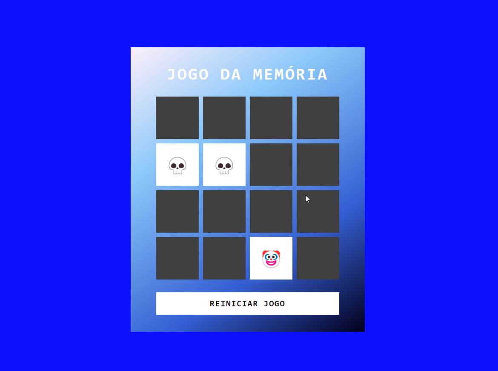

# Bootamp DIO - Potência Tech iFood - Desenvolvimento de Jogos
> Desafio DIO - Criando um Jogo da memória com Emojis Utilizando Javascript

## 📋 Índice
- [Link do projeto:](https://finandolopes.github.io/Jogo_Da_Memoria/)

- [📖 Sobre](#-Sobre)
## 📖 Sobre
Projeto desenvolvido durante o Bootcamp [Potência Tech iFood - Desenvolvimento de Jogos](https://web.dio.me/track/potencia-tech-ifood-desenvolvimento-de-jogos)

- [🚀 Tecnologias utilizadas](#-Tecnologias-utilizadas)

# - Tecnologias: HTML, CSS e JavaScript

- [🖥 Preview](#-Preview)

